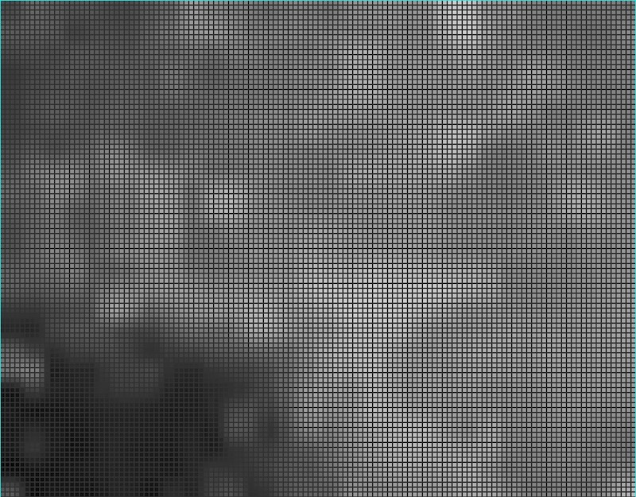
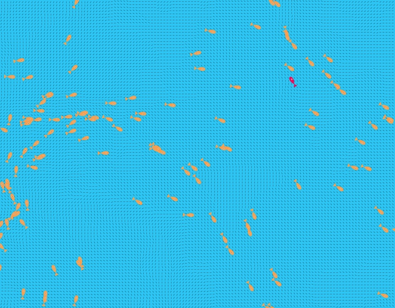

# Explanation on how to create a flow field from an image

In Chapter 5 of "The Nature of Codde," Daniel Shiffman explains how to create a flowfield for agents to follow. I have implemented the suggestion from Exercise 5.8 to create a flowfield from an image.

## Procedure

1. Find an suitable image--I tried to find one with a lot of color and swirls because I wanted to simulate an ocean current. I ultimately decided on an image on the Nasa.gov website that I thought would work well enough. 

2. Crop a sub-section from the image - I used a 32x25 pixel section. I initially tried using the whole image at a lower resolution, but the results weren't very good. 

3. Generate the grid image.  There are a couple of ways to accomplish this. I have two different sketches in the [here](GENERATE_GRID_IMAGE). The simplest adapts some code from Daniel Shiffman to pixelate the image and then applies a filter to change the image to grayscale. The second uses the p5.FIP library to pixelate the image and then change to grayscale. Note that I decided to change to grayscale because I am only using the r value to assign the flowfield and though this is the best way to yield consistent results.

 I haven't spend a lot of time playing around with this, but my preliminary efforts suggest it is best to use a very low resolution image and set the "pixelSize" to a small number.

```JavaScript
pixelate.setUniform("pixelSize", 0.01);
```

<p align="center"></p>

In the gridArray.js file, the flowfield is initialized with the same vector.

```JavaScript
this.field = Array(this.cols)
      .fill()
      .map(() => Array(this.rows).fill(createVector(1, 0)));
```

At this point, all of the agents would follow the flowfield horizontally across the canvas. Very boring! We can add realism by using the image to add addtional angles to the flowfield. As already mentioned, the angles are assigned according to the value of r.

```JavaScript
 gridArray() {
    this.img.loadPixels();
    for (let i = 0; i < this.img.width; i++) {
      for (let j = 0; j < this.img.height; j++) {
        let index = (i + j * this.img.width) * 4;
        let r = this.img.pixels[index + 0];
        if (r < 16) {
          this.field[i][j] = createVector(1, 0);
        } else if (r >= 16 && r < 32) {
          this.field[i][j] = createVector(sqrt3 / 2, 0.5);
        } else if (r >= 32 && r < 48) {
          this.field[i][j] = createVector(sqrt2 / 2, sqrt2 / 2);
        } else if (r >= 48 && r < 64) {
          this.field[i][j] = createVector(0.5, sqrt3 / 2);
        } else if (r >= 64 && r < 80) {
          this.field[i][j] = createVector(0, 1);
        } else if (r >= 80 && r < 96) {
          this.field[i][j] = createVector(-0.5, sqrt3 / 2);
        } else if (r >= 96 && r < 112) {
          this.field[i][j] = createVector(-sqrt2 / 2, sqrt2 / 2);
        } else if (r >= 112 && r < 128) {
          this.field[i][j] = createVector(-sqrt3 / 2, 1 / 2);
        } else if (r >= 128 && r < 144) {
          this.field[i][j] = createVector(-1, 0);
        } else if (r >= 144 && r < 160) {
          this.field[i][j] = createVector(-sqrt3 / 2, -1 / 2);
        } else if (r >= 160 && r < 176) {
          this.field[i][j] = createVector(-sqrt2 / 2, -sqrt2 / 2);
        } else if (r >= 176 && r < 192) {
          this.field[i][j] = createVector(-1 / 2, -sqrt3 / 2);
        } else if (r >= 192 && r < 208) {
          this.field[i][j] = createVector(0, -1);
        } else if (r >= 208 && r < 224) {
          this.field[i][j] = createVector(1 / 2, -sqrt3 / 2);
        } else if (r >= 2224 && r < 240) {
          this.field[i][j] = createVector(sqrt2 / 2, -sqrt2 / 2);
        } else if (r >= 240) {
          this.field[i][j] = createVector(sqrt3 / 2, -1 / 2);
        }
      }
    }
  }
```

In the actual implementation, I don't have the flowfield showing (short black lines), but it is useful to see what is going on by rendering them.

<p align="center"></p>

## Resources

- [Image Source](https://www.nasa.gov/image-article/chandra-and-webb-spy-a-cosmic-wreath/)

- [Flow field assset](https://editor.p5js.org/kfahn/sketches/-j7pTIZ6J)

https://editor.p5js.org/kfahn/sketches/KzdRdBvL3

https://editor.p5js.org/kfahn/sketches/gJrnK1gf8
